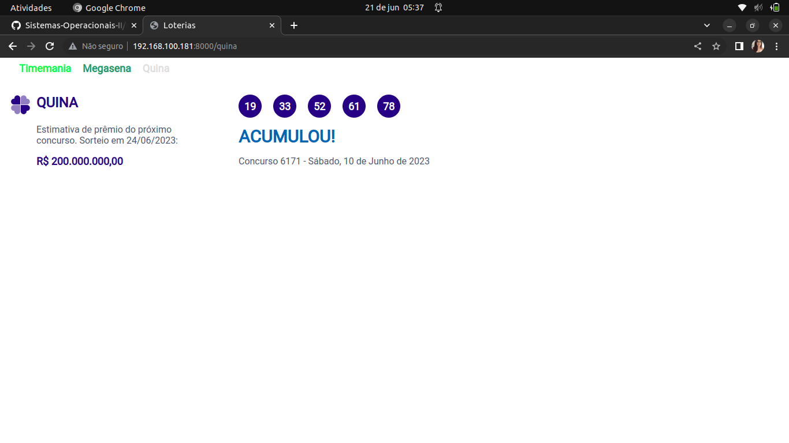

<h2>No Windows </h2>

Para rodar o projeto:

- Certifique-se de ter o python instalado;
- Após clonar o projeto, entre na pasta Loteria-Django/loteria com o comando: ```cd loteria``` ;
- Em seguida, instale o Django com o comando: ```pip install Django``` ;
- Por fim, execute o projeto com o comando: ```python manage.py runserver``` .


## No Debian

Para rodar o projeto:

- Atualize seus pacotes com o comando: ```apt-get update``` ;
- Instale o Python e o pip (gerenciador de pacotes do Python) com: ```apt-get install python3 python3-pip tree -y``` ;
- Em seguida, instale o Django com: ```pip3 install Django``` ;
- Acesse a pasta opt com: ```cd/opt``` ;
- Para clonar o projeto é necessário ter o git instalado na máquina. Para instalar use o comando: ```apt-get install git``` ;
- Hora de Clonar! Clone o projeto com: ```git clone https://github.com/laaridiniz/Sistemas-Operacionais-II.git``` ;
- Entre no repositorio com: ```cd Loteria-Django``` ;
- Acesse a pasta do projeto com: ```cd loteria```;
- Configure o IP da máquina no arquivo settings.py: ```ALLOWED_HOSTS = ['SEU_IP']``` ;
- Em seguida, é só rodar o projeto com: ```python3 manage.py runserver 0.0.0.0:8000``` .


## Resultado

https://github.com/laaridiniz/Sistemas-Operacionais-II/assets/86115352/57cb2700-8c0d-4a64-ab5e-f2ec8e4153df

<br>
<div>
  
  <br>
  <br>
  
</div>
